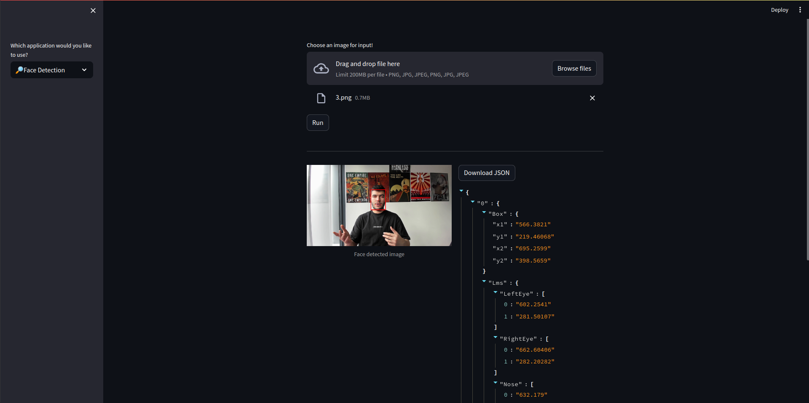
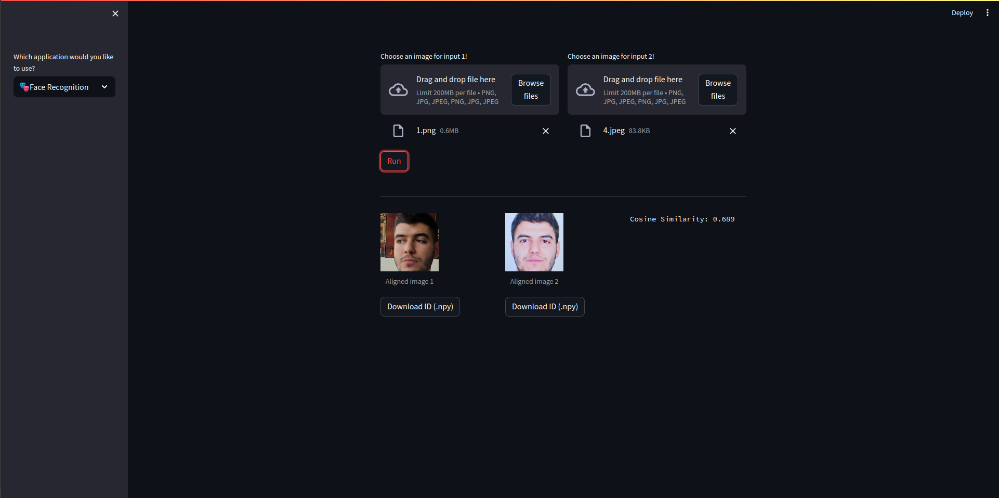
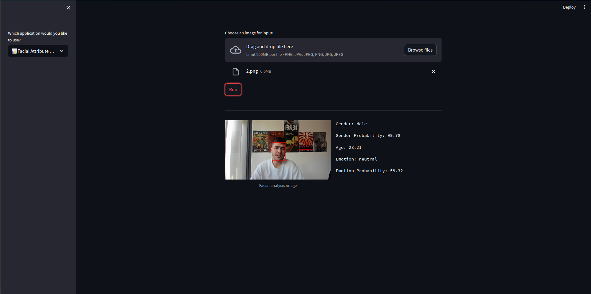
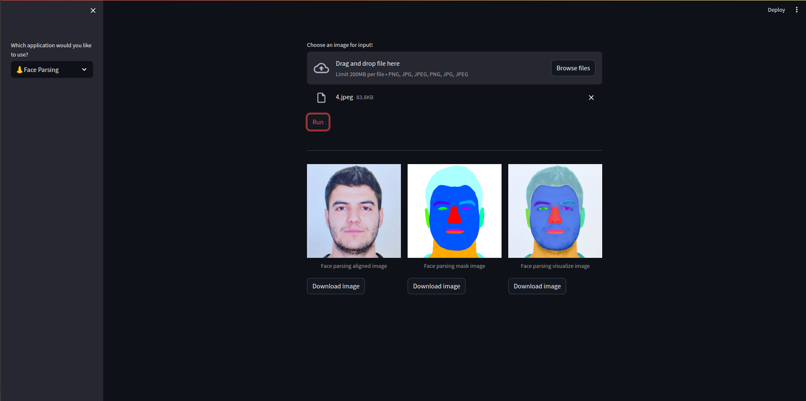
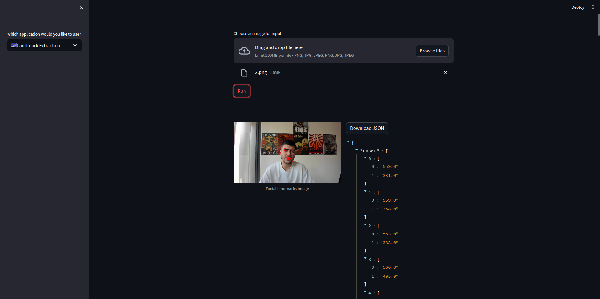
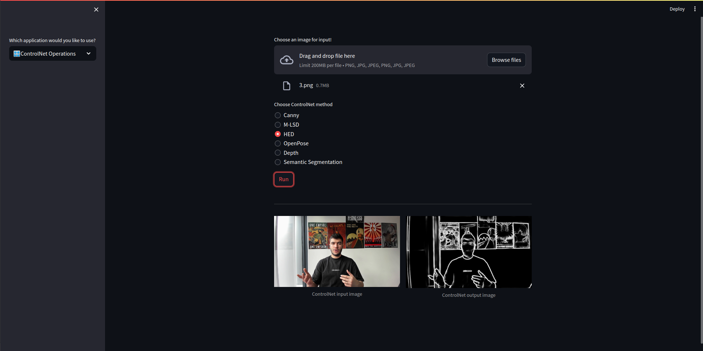
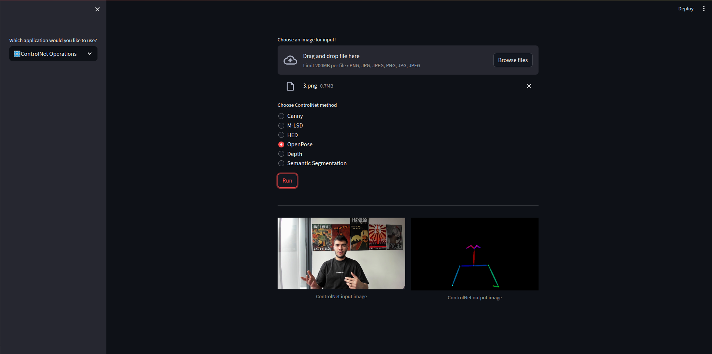
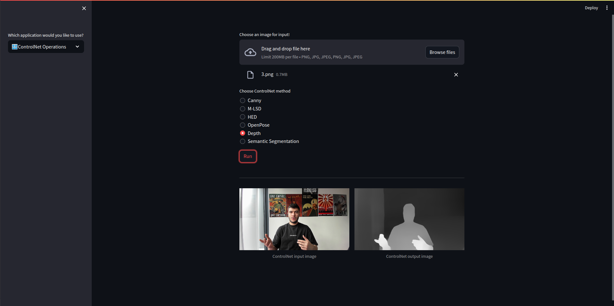
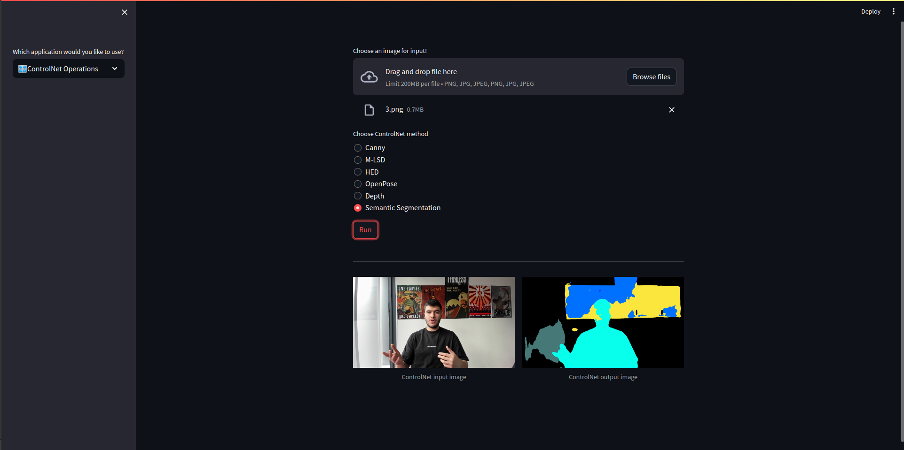

# Face Detection

# Face Recognition

# Facial Attribute Analysis

# Face Parsing

# Landmark Extraction

# Head Pose Estimation

# ControlNet Operations
## Canny

## M-LSD

## HED

## OpenPose

## Depth

## Semantic Segmentation

